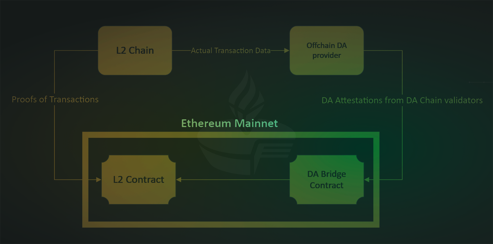

# ⚙ General Purpose DACs Mechanism

#### There are usually three parties in the process:

1 - The L2 chain that receives and records transactions

2 - The offchain DA provider

3 - Ethereum Mainnet

<figure><figcaption></figcaption></figure>

The actual Transaction Data is sent to the Offchain DA provider and is put into a block ensuring that the data is available.

On the Offchain DA provider side validators sign the Merkle Root of DA Attestation and send it to the DA Bridge Contract on Ethereum for verification and storage.

In the meantime, the proofs of transactions from the L2 Chain are also published to Ethereum Mainnet to the L2 contract on the Mainnet, which handles fraud and validity proofs and checks that the underlying data is available via the DA Bridge contract.

#### Pros :thumbsup:

* These permissionless DACs come with extra-economic guarantees on data availability because the committee can be slashed if they misbehave.
* They are more credibly neutral as a DA layer than a DAC, because it exists as an independent chain in its own right as a general-purpose DA layer, rather than a DA layer for a specific Ethereum L2.

#### Cons :thumbsdown:

* They are cost-effective and less costly than pure rollups, but the more decentralized they get and the more signatures they need per attestation, the costlier they get.

#### Examples&#x20;

Celestia, Polygon Avail, and EigenDA
