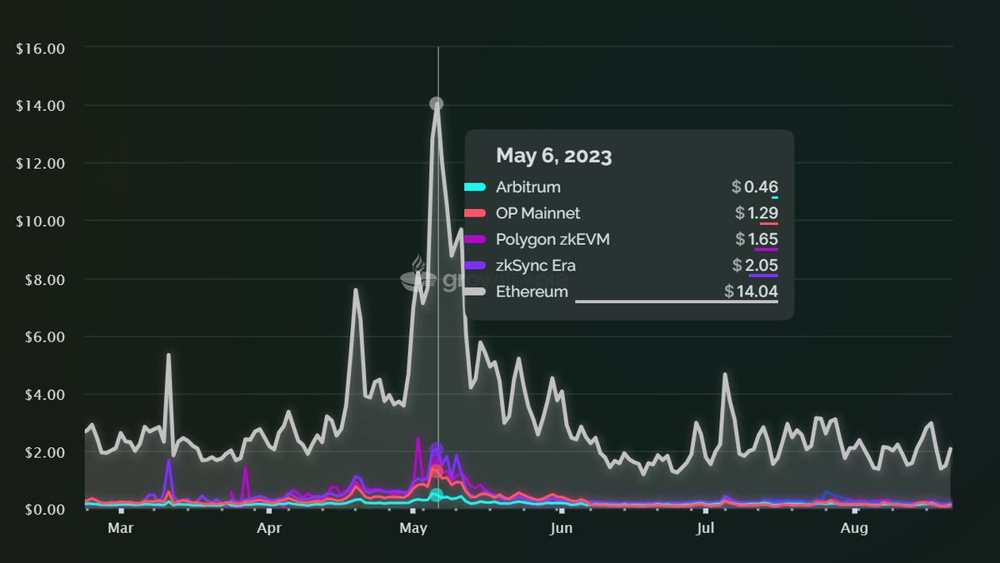

# 🏄♂ Onchain Data Availability

## Onchain :man\_surfing::chains:

All the rollups such as Optimism or zkSync use direct onchain data availability, which can get quite expensive especially when onchain activity increases, take for example bullish news on Ethereum.

Like around the 6th of May 2023 when the EIP 4844 was a hot topic:

<figure><figcaption></figcaption></figure>

With more and more rollups settling on Ethereum L1 in hopes of scaling Ethereum and ensuring Ethereum’s top security guarantees, the problem of network congestion rises again. But there is an upcoming Onchain solution to this: The **Ethereum Cancun** upgrade, also known as EIP-4844.
