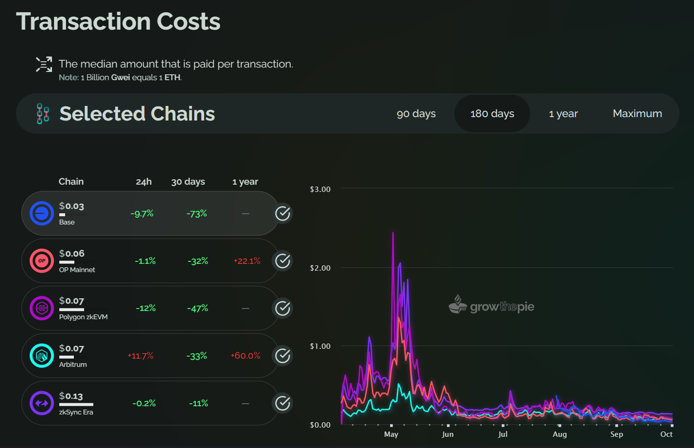

# 🔵 Base

Base is incubated inside Coinbase, with the aim of bringing the publicly traded company Coinbase, with all their assets and users, Onchain.

It is devoted to paving the path for other builders and companies to bring themselves and the first billion users onchain, enabling various use cases, which promises to increase economic freedom globally.

**1. Navigating Industry Challenges**: Base confronts crypto industry challenges like competition and regulatory uncertainties. Their approach involves technical decentralization and strategic collaborations.

**2. Commitment to Neutrality and Funding**: Base emphasizes op stack core development, neutrality, and decentralization. Their goal is to establish sustainable funding for a global on-chain economy.

**3. Developer-Centric Vision**: Base is crafting a developer platform in line with crypto and Ethereum values, actively collaborating and seeking insights to uphold industry standards.

> “For the first time, it puts everyone on the same playing field, if you are building from anywhere in the world, you can build an app that everyone can use and have access to” Jesse Pollak, Head of Protocols at Coinbase and the Creator of Base

##

## Usage

### For Users: Why use Base?

#### Transaction Costs

<figure><figcaption><p>Transaction Costs of Base and other Layer 2s</p></figcaption></figure>

As of now Base is the cheapest top L2 to use. This might change of course, have a look at our [Transaction Costs metric](https://www.growthepie.xyz/fundamentals/transaction-costs).

#### Ecosystem

There are a multitude of things to do in Base and already more are coming up, with the top active dApp being the social platform [friend.tech](http://friends.tech/) where celebrities trade loyalty keys with fans and friends.

Check 👇 for more dapps and platforms on base

[Base | Ecosystem](https://base.org/ecosystem?tag=all)

You might also want to follow [@Base\_Explorer](https://x.com/Base\_Explorer/) for updates, facts and info in the ecpsystem and



#### How Secure/Decentralized is Base?

To go in-depth into security and decentralization we recommend checking out the L2 Beats page for Base 👇



### For Devs

#### **Why build on Base?**

<details>

<summary><strong>Backed by Ethereum</strong></summary>

Base combines Ethereum's robust security with Coinbase's expertise, ensuring a safe environment for your decentralized apps. Transition smoothly from Coinbase, Ethereum L1, and other compatible chains into Base.

</details>

<details>

<summary><strong>Boosted by Coinbase</strong></summary>

With Base, decentralized app development is simplified, thanks to integration with Coinbase’s suite of products and tools. Developers can effortlessly tap into Coinbase's vast ecosystem, which boasts over 110M verified users and $80B in assets through Coinbase product integrations, easy fiat onramps, and powerful acquisition tools.

</details>

<details>

<summary><strong>More Bang, Less Buck</strong></summary>

Base offers full EVM equivalence at a fraction of the cost and is committed to pushing forward the developer platform. You get all the fancy features without burning a hole in your pocket, offering features like gas-free transactions through intuitive Account Abstraction developer APIs and facilitating the creation of multichain apps with user-friendly bridges.

</details>

<details>

<summary>Open Source</summary>

Base's vision is a decentralized, open, and accessible platform, aspiring to set the standard with a modular, rollup-neutral Superchain driven by Optimism. As a Core Dev partner on the OPStack, they're fostering a vibrant developer community.

</details>


To go head-on into the documentation and the boot camp to build your dapp, here are the links for your convenience:

[About Base in details | docs.base (1)](https://www.notion.so/About-Base-in-details-docs-base-1-5d72c647506b4a05a54db494b1b6f0bc?pvs=21)

[Welcome to Base Camp for Devs | Base (1)](https://www.notion.so/Welcome-to-Base-Camp-for-Devs-Base-1-519228e9aa22463a87aacb03122d8832?pvs=21)

[Introducing Base Camp: Learn Smart Contract Development At Your … — Base (1)](https://www.notion.so/Introducing-Base-Camp-Learn-Smart-Contract-Development-At-Your-Base-1-98aa10154520481eada1e844a9fbceb7?pvs=21)

### For Investors:

You might want to look at some of our charts to help you make your financial decisions

PS; As of now there is no token for Base, but there is already some other ways to invest in the platforms built on Base

#### Onchain Profit

This is what the chain makes in profit onchain each day. It quantifies profitability by comparing the revenue generated from L2 gas fees collected to the costs associated with data & proof posting onto the Ethereum blockchain. See current metrics [here](https://www.growthepie.xyz/fundamentals/profit).

#### Daily Active Addresses

See the usage trend of the usage and user base of Base. See current metrics [here](https://www.growthepie.xyz/fundamentals/daily-active-addresses).

#### Top contracts on Base

To find the most active projects on Base the best tool is to explore the blockspace for contracts that have the highest consumption of gas or the highest transaction count. See current blockspace analytics [here](https://www.growthepie.xyz/blockspace/chain-overview).

##

## Technology

### OP Stack Bedrock

Base uses OP Stack, the Bedrock version, for building its chain and is considered an OP chain within Optimism’s ecosystem.

#### **Why are developers choosing OP Stack?**

In essence, the OP Stack brings the concept of modular blockchains to life 💡. It's all about providing developers with a ready-made platform, eliminating the need to start entirely from square one.

In the OP stack, there are three primary layers:

1. **Consensus** 🤝: This layer encompasses **Data Availability and Derivation**.
2. **Execution** 🔄
3. **Settlement** 💼

Each of these layers functions as an API, offering flexibility and customization. As long as you align with the APIs, the sky's the limit for what you can build!

#### Let's break down OP Stack further:

Here I will provide a short explanation of each layer accompanied by a mathematical representation, for better learning.

*   **Data Availability Layer**: Think of this as a storage unit, holding an array of bytes.

    ```jsx

    type DA = bytes[]

    ```
*   **Derivation Function**: This function takes in the previous state and the data from the availability layer. Depending on the input, it either produces a payload or returns nothing.

    ```jsx

    derive(previous State, DA) ⇒ {Payload or null}

    ```
*   **Execution Function**: Acting on the payload generated by the derivation function, this function processes the previous state to produce a new state.

    ```jsx
    execute(previous State, payload) ⇒ boolean (0 or 1)

    ```
*   **Validity Function**: The final check! This function ensures the new state is valid, considering all other functions.

    ```jsx

    valid(previous State, new State, DA, derive, execute)

    ```

The OP Stack marks the initial stage in the rapid growth of highly compatible Layer-2s and Layer-3s, collectively referred to as **op-chains** within Optimism's ecosystem.

As we look ahead, the boundaries between op-chains will dissolve, giving rise to a unified **Superchain.** This Superchain will seamlessly integrate multiple op-chains, allowing for the shared utilization of collective resources.

For more in-depth however concise explanation of OP Stack check this Youtube, it is fun to watch!

[https://youtu.be/jnVjhp41pcc?si=\_fK6krDT8xfkGLkz](https://youtu.be/jnVjhp41pcc?si=\_fK6krDT8xfkGLkz)

### Why should you care about the Superchain?

Toggle for more info

<details>

<summary><strong>Accelerate activity</strong></summary>

Base will bring Coinbase’s onchain products and user base into the Superchain ecosystem, increasing activity in the Superchain while enabling Coinbase users to interact with dapps and move assets across the ecosystem seamlessly.

</details>

<details>

<summary><strong>Be a part of the Public Goods Infrastructure</strong></summary>

Base will provide a percentage of the fees earned through transactions to the Optimism Collective to be apart of the Superchain, contributing back to funding the core public goods infrastructure of both the Superchain and the broader crypto economy.

</details>

<details>

<summary><strong>Easier development</strong></summary>

* Base’s collaboration with OP Labs and the optimism collective strives to make it easier for developers tobuild new L2s and rollups, and deploy their applications across the Superchain.

<!---->

* For example, Base is collaborating with the Optimism Collective to co-create primitives (e.g. for identity) that can be used on L2s that join The Superchain, including Base and Optimism Mainnet.

</details>

<details>

<summary><strong>Build towards an interoperable crypto economy</strong></summary>

* Superchain will seamlessly integrate multiple op-chains, allowing for the shared utilization of collective resources.

<!---->

* In the long run, this will also enable you to move your product seamlessly to another OP chain if youdecide it is more suitable to your desires.

</details>

For more in-depth reading on the topic of Superchain w recommend this article





##

## Roadmap

#### **Objective**

In 2023, Base’s objective is to advance Base and Optimism Mainnet from a Stage 0 rollup, as characterized by Vitalik Buterin, to a Stage 1 roll-up. This progression aims to enhance **decentralization** and **trustlessness** significantly.

To realize this, Base is set to collaborate with **OP Labs** and the Optimism Collective.

#### **Milestones for 2023**

1. **Fault Prover Launch:**
   * Develop and launch a minimum of one fault prover for the OP Stack.
   * This will fortify both Base and Optimism Mainnet by utilizing a consortium of validators to detect and contest faults.
2. **Decentralization of Upgradeability:**
   * Implement decentralization in the upgradeability of the Base and Optimism Mainnet smart contracts.
   * Initially, transition to a security council with a decentralized quorum, ensuring no single entity has control.
3. **Superchain Initial Version Release:**
   * Roll out the initial version of the Superchain capable of sequencing transactions for Base, Optimism Mainnet, and any OP Stack rollup.
   * This ensures the preservation of participatory rights for everyone within these ecosystems.

#### **2024 Vision:**

In the subsequent year, 2024, the focus will be on elevating Base and Optimism Mainnet to Stage 2 rollups. The aspiration is to achieve decentralization and security levels parallel to those of Ethereum.

##

## Featured Content

#### **Public Launch First-Day Post for Base**



#### **The flippening of daily transactions (Ethereum <> Base) for the first time**



## Official Pages and Links


Base metrics on growthepie.xyz


[About Base in details | docs.base](https://www.notion.so/About-Base-in-details-docs-base-7065ed6b6e984dcc959678c945e3d794?pvs=21)

[Welcome to Base Camp for Devs | Base](https://www.notion.so/Welcome-to-Base-Camp-for-Devs-Base-aa1771da3a844aceb08853c8c3815232?pvs=21)

[Introducing Base Camp: Learn Smart Contract Development At Your … — Base](https://www.notion.so/Introducing-Base-Camp-Learn-Smart-Contract-Development-At-Your-Base-e0a490c0451f44faaa97176fd5834b96?pvs=21)

#### Must-Read Articles

[Base is open for everyone — Base](https://www.notion.so/Base-is-open-for-everyone-Base-19382afe28874a52be6953ebeba7c62c?pvs=21)

[Introducing Base Coinbase Article](https://www.notion.so/Introducing-Base-Coinbase-Article-d1c24263af394b9fb8d3a7490aa165ed?pvs=21)

[Base’s Commitment to Decentralization with the Superchain — Base](https://www.notion.so/Base-s-Commitment-to-Decentralization-with-the-Superchain-Base-310ee7cf452c469cb317beb8a4930c44?pvs=21)

[Contributing to the Scalability of Base and the OP Stack: A Tech… — Base](https://www.notion.so/Contributing-to-the-Scalability-of-Base-and-the-OP-Stack-A-Tech-Base-e11e71b4000d401c87f88b09eab5c960?pvs=21)

#### Videos and Podcasts



